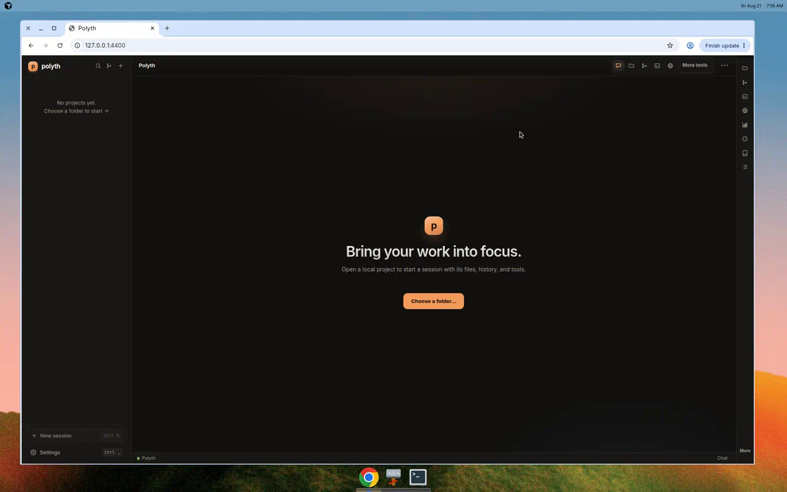
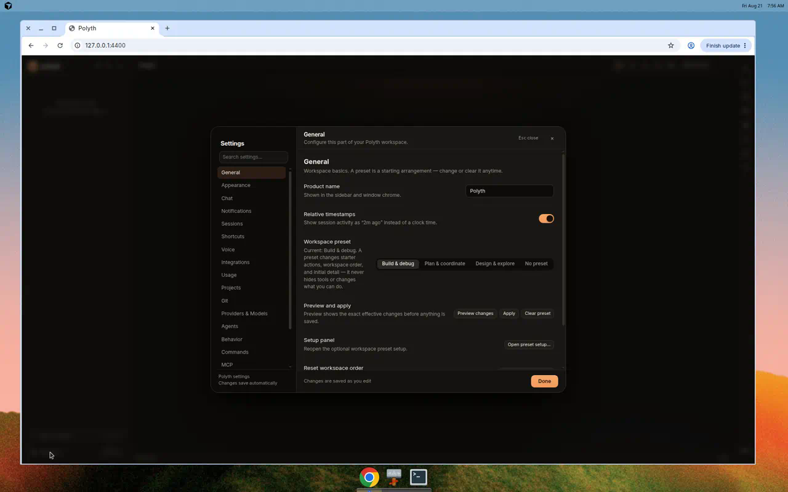
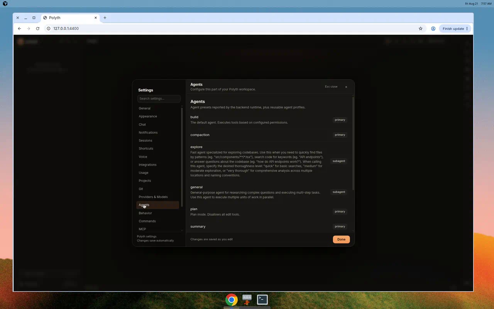

# Polyth

**A customizable home for working with coding agents.** Polyth runs on your machine as a single web app: open a folder, start a session, and work with an agent that can read and edit your files, run commands, use Git, and keep every step of the conversation on a permanent, replayable record.

It's built for very different people to work in very different ways — chat-first if you never want to see a terminal, deep tooling if you live in one. And when something doesn't fit how *you* work, Polyth is designed to be reshaped: open a session on Polyth's own code and ask the agent to change it. The codebase is contracts-first and package-per-feature, with typed UI extension slots, precisely so an agent can extend it safely.



*First launch: an empty workspace with a folder picker. Choose a local folder and Polyth opens it as a project — sessions, files, history, and tools all scoped to that folder.*

## Quick start

Prerequisites: Node >= 22.18 (the server runs TypeScript directly via type stripping; earlier 22.x releases fail) and the [opencode](https://opencode.ai) CLI on your PATH (`curl -fsSL https://opencode.ai/install | bash`). The `gh` CLI is optional, for GitHub features.

```bash
npm install
npm run build        # bundles apps/web
npm start            # open http://127.0.0.1:4400 (spawns `opencode serve` per project)
```

Env: `PORT` (default 4400), `POLYTH_DATA_DIR` (default `./data`). The server binds all interfaces (`*:4400`), not just localhost — anything that can reach the port can use it, and with no password configured there is no auth at all. Set `POLYTH_UI_PASSWORD` to require a login before running it on anything but a trusted machine.

## What you can do

- **Converse and steer.** Streaming replies, a message queue, mid-turn steering, fork and rewind — the session log is append-only, so history is never silently rewritten.
- **Stay in control.** A fail-closed permission engine previews every risky action before it runs; approve once, or "always" at exactly the scope you choose; opt in to auto-accept per session.
- **Work the project.** File browser and editor with conflict guards, Git with worktrees, terminal tabs, dev-server preview, and an agent-drivable browser (when Chromium is available).
- **Go multi-model.** Run one prompt across several models in parallel and pick the winner, or fuse their answers into one synthesis with attribution and disagreements.
- **Review before you trust.** Generated diff walkthroughs and structured reviews of what the agent changed.
- **Schedule and remember.** Recurring or one-shot prompts on at/every/cron cadences with time zones; a knowledge store of notes, plans, and memories you can attach to any chat.
- **Connect out.** GitHub issues, PRs, and checks through the `gh` CLI; MCP servers; provider quota tracking; optional voice dictation and read-aloud via browser speech or your own OpenAI-compatible endpoints.

## Make it yours



*Every preference in one searchable place — including workspace presets (Build & debug, Plan & coordinate, Design & explore) that rearrange the workspace for how you work without hiding any tools.*


*Pick a default model and toggle whole providers or individual models; the catalog is shared, so every client sees the same choices.*



*Agent presets reported by the runtime — build, plan, explore, and more — plus reusable agent profiles.*

Beyond settings: six bundled themes (plus follow-system and paste-your-own JSON token themes), an editable keymap with conflict detection, your own slash commands and `#` snippets at user or project scope, server-owned behavior instructions, and a typed client-side UI-slot registry (`window.__polythSlots`) so the agent — or browser-side code — can add surfaces without touching core files. Installed server-side plugins can declare slot contributions, but those descriptors are not yet rendered in the client.

## Status

Polyth tracks feature parity with polyth and Paseo in a per-feature matrix: [`docs/parity/polyth-parity.yaml`](docs/parity/polyth-parity.yaml). That matrix — not this README — is the source of truth for what's done; rows marked `planned` are not shipped, and rows marked `implementing` are not fully shipped (their notes say which subsets exist).

## Documentation

- [`docs/dev/architecture.md`](docs/dev/architecture.md) — orientation plus the deep reference: packages, protocol, event vocabulary, UI slots.
- [`docs/dev/README.md`](docs/dev/README.md) — how to build a new feature from zero.
- [`AGENTS.md`](AGENTS.md) — the rules coding agents follow in this repo.
- [`CHANGELOG.md`](CHANGELOG.md) — project history by milestone.

## Development

```bash
npm test             # node --test across packages
mkdir -p /tmp/oc-probe   # the live smoke test hard-codes this cwd
POLYTH_REAL_OPENCODE=1 node --test packages/backend-opencode/test/adapter.test.ts  # live opencode smoke
```

No root typecheck script: run `npx tsc --noEmit` inside each package you touch (each extends `tsconfig.base.json`).
