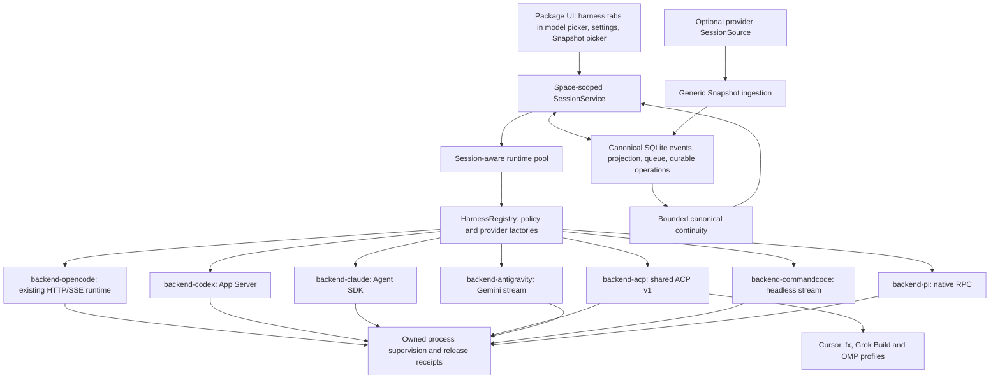

# Polyth multi-harness foundation

This document describes the current multi-harness implementation. PR #125 (`d8805c819831f321a3eec420f891994976b7bc4e`) was reviewed as a donor, not used as the implementation base. Verification evidence is dated where it appears below.

Polyth owns the conversation, queue, project and worktree relationship. A harness supplies an `AgentRuntime`. Switching changes the runtime leg of the existing canonical session.

## Architecture



The new registry selects factories. It does not replace `AgentRuntime`, reconciliation, endpoint identity, the durable operation journal, or the existing runtime epoch transaction. Providers register through package discovery and the existing service registry. The desktop's generated-style package inventory mirrors server discovery. A local provider daemon launched by Polyth is an implementation detail inside that ownership boundary; it is never an ambient service that Polyth merely hopes to find again.

`backend-opencode` registers the existing managed OpenCode pool. Its existing composition-root wiring still owns configuration restart barriers and shared-project runtime management; this was preserved deliberately. No central session or importer switch statement dispatches on Claude, Codex, Cursor, fx, or other vendor names.

Runtime pool keys include Space, project, cwd, canonical session and harness. Settings persist under `host.spaceStorage(ctx)`. Routes resolve scoped services through `host.forSpace(rc.space)`. Native history handles are bound to the validated Space and project.

## Session identity and routing

| Identity | Meaning |
| --- | --- |
| Polyth session ID | The durable product identity: one projection, timeline, title, queue, goals, project, and worktree relationship. |
| Runtime leg ID | One native execution context. Records harness, native ID, start time, bootstrap mode and canonical dialogue checkpoint. Closed legs remain in `harness/switched` events with an end time. |
| Native session/thread ID | A subordinate provider reference for execution, verified reattachment and reconciliation. It never becomes the Polyth session ID. |
| Runtime authority and generation | The execution ownership evidence used to fence observations and prove release. This is independent of native conversation identity. |

Title authority stays canonical. A harness declares `title: "native"` only when it publishes a semantic title (an event or a session-list name); a harness whose provider does not generate titles declares `title: "emulated"` so the canonical layer persists the prompt-derived fallback immediately, and an adapter may still publish a best-effort generated native name that refines that fallback. The runtime create/reset/resume input carries the projection's `titleSource` so an emulating adapter can tell an authored title (`manual`/`native`) from a Polyth prompt fallback (`polyth`) or placeholder: only the former suppresses generation, and a fallback is never written into a native session name as though it were authored. For a native-title harness, the session service reads the runtime's session list on a bounded schedule after the terminal event so a late title still wins, then settles on the prompt fallback if no semantic title materializes.

New sessions persist `{ mode: "auto" }` separately from `resolvedHarnessId`. Auto uses deterministic priority and ID ordering, and stays on the persisted route. An explicit pin never silently selects another harness. Auto can try another ready factory when constructing a new, unbound session fails before native creation. Persisted routes do not use this fallback path.

A synchronized native leg can be reattached where the adapter supports verified continuity. Returning A → B → A creates a fresh A leg. A mismatch between the leg's effective dialogue checkpoint and current canonical history also forces fresh continuity. Profile intent survives switching, while the old profile's model/account selection is cleared. Model catalogs come from the selected session runtime; harness identity is not encoded into `providerID`.

## Safe switch algorithm

1. Under the existing session lock, persist a switch intent containing the target, timing and transition ID. Fence new turn admission; new messages can queue.
2. Default to finishing the active turn. “Stop and switch now” records explicit stop intent and uses existing abort machinery.
3. Reconcile the old runtime. A local idle marker, abort acknowledgement, timeout, disconnected channel or missing PID is not a release proof. Unresolved operations remain unresolved.
4. Require `releaseExecution` to confirm the exact old authority and generation. OpenCode's shared runtime barrier also rejects release while a neighbouring session on that authority is busy or unresolved.
5. Persist `harness/execution-released` before constructing the target runtime. Unwire the old runtime and evict its pool entry.
6. Prepare target native creation through the existing durable operation journal. A different harness is constructed without the source harness's model identity; same-harness fresh legs retain compatible launch settings. Persist the provider's exact native receipt. A missing response is never retried speculatively; recovery requires a matching operation receipt, not a title or timestamp guess.
7. Atomically publish the runtime epoch, target route, fresh leg, and closed prior leg. Clear transition state and stale model/profile routing in the same transaction.
8. Establish the fresh binding and reconciliation barrier, then admit the next turn with bounded canonical continuity. The canonical user event contains the user's text; recovery context is separately persisted and hidden by the timeline renderer.

The target creation path uses the adapter's operation-aware fresh-session seam
directly; a newly selected harness has no native history to reset. Exact-history
reset is only a compatibility fallback for adapters without a create seam.
Canonical continuity is transferred separately and the native tail is never claimed
to have been copied.

A crash after target creation but before publication resumes the recorded receipt. A target creation with no recoverable receipt stays blocked instead of making another native thread. A pending after-turn switch can be escalated to stop-now. An unresolved target cannot currently be replaced with a different pending target.

### Local execution ownership

All implemented local runtime families use the same Linux process authority. A small bundled Polyth supervisor installs `PR_SET_CHILD_SUBREAPER`; a separate owner pipe gates native launch until Polyth persists the authority ledger. Closing that pipe on a Polyth crash triggers shutdown. The supervisor kills and reaps its descendants, including detached/double-forked tools, and writes an exact release receipt only after the descendant set is empty. That containment release is forceful, so an adapter that shares user-level credential state with other native processes must end its own transport and let the native process exit before releasing containment.

Claude Code coordinates OAuth refresh through `~/.claude/.oauth_refresh.lock`, which stays contended for its 60-second staleness window after a holder dies. A containment SIGKILL while the CLI holds that lock makes every other Claude Code process, including Polyth's own recovery legs, fail to refresh for about a minute. The Claude adapter therefore closes the SDK query and waits for the native process to finish (bounded, then forced) before `authority.close()`, and classifies a residual shared-lock failure as a bounded retry on the existing resume path rather than a sign-in failure. Before that, `authority.close()` ran first and the supervisor's immediate descendant SIGKILL could strand the lock. Where a user systemd manager is available, Polyth launches that supervisor in a generation-specific transient scope. The scope is the kernel-backed fallback owner if the supervisor itself disappears: Polyth kills that exact scope, waits until systemd proves it empty, and only then persists a replacement release receipt.

PID start-time checks prevent signalling a reused PID. A host boot-ID change also proves that a scope from the previous boot cannot still execute. Without a valid receipt, scope-empty proof or boot change, killing the supervisor still leaves execution outcome unknown and blocks replacement. OpenCode's native endpoint incarnation and containment identity are recorded in this ledger, allowing old release evidence to survive a server restart.

For owned OpenCode, transport recovery first rebuilds the connection and protocol against the current endpoint. If the readiness path proves the endpoint unresponsive, Polyth stops the old owned boundary instead of retrying the failed provider mutation, starts a new generation, and emits `endpoint-replaced`. The session service enumerates every canonical session wired to that physical runtime, reconciles it, creates a fresh native session where required, fences unresolved old-generation operations and restores only confirmed canonical Polyth history. One failing session cannot authorize or suppress recovery for a different project/runtime key.

A harness that keeps a stable authority id but advances its generation across its own restart (generation-only continuity, e.g. Pi/CommandCode) is the same owned identity break. Recovery may replace that epoch only after `releaseExecution` proves the exact persisted authority, generation and backend session were released. A generation change with no such proof — or a non-successor generation — stays blocked instead of being treated as an implicit release, so a live execution is never signalled by guesswork.

This proof covers owned local process descendants. Borrowed endpoints, SSH execution and non-Linux switching do not gain a fictional shutdown guarantee. Existing OpenCode operation on those platforms remains available, but cross-harness switching requires a supported release proof. The bundled supervisor is Linux-specific; the transient-scope fallback additionally requires a working user systemd manager. A legacy authority ledger created without containment remains blocked after a lost supervisor receipt. Polyth records the boot ID on the first blocked observation; only a later host boot proves the old local execution boundary empty and permits automatic recovery.

The accepted [owned-runtime recovery ADR](./owned-runtime-recovery.md) records the alternatives, trust boundary, compatibility path and rollout limits for this containment model.

## Exactly what continuity transfers

Epoch recovery, first Snapshot continuation and harness switching reuse the existing session recovery builder. Its limits remain 40 dialogue messages and 16,000 characters, with deterministic section budgets. Workspace collection is outside the pure builder.

The bundle contains:

- Active canonical objective and current behavior/instructions; agent profile name/notes as intent, without its old model/account route.
- Effective pinned user/assistant messages, attached knowledge and relevant persisted summaries.
- Recent confirmed user/assistant text, respecting rewind/fork history, ignored events and durable mutation outcomes. Attachment names and MIME references can be retained; binary attachment translation is adapter-dependent.
- Current cwd, and bounded Git branch, HEAD, dirty status and modified/untracked filenames when available. No repository copying and no diff bodies. Failed or remote Git inspection leaves unavailable facts absent.
- An explicit statement that the workspace is authoritative and unconfirmed operations must not be assumed successful.

When the Behavior setting **Include workspace AGENTS.md** is enabled, the first
admitted prompt on every fresh runtime leg also carries the active worktree's
`AGENTS.md`, when present, in the same hidden `recoveryContext` channel. The
setting is off by default. The visible `user/message` text remains unchanged.
Harness switches therefore re-read current workspace policy instead of copying
the prior leg's hidden wrapper. Reads are path-confined and capped at 32 KiB; a
missing or empty file is a no-op, while an unsafe, non-text or oversized file
blocks admission instead of being silently ignored or truncated. If the
setting is enabled but the files-owned reader is unavailable, admission also
fails closed because absence cannot be established.

It does not transfer native transcripts, reasoning, private system prompts, tool trace dumps or invented summaries. Existing recovery context is removed before constructing another bundle. Secure Safe values, known sensitive environment values and common credential syntax are redacted before budgeting. The UI renders the original user text, not the recovery wrapper.

Native observations carry the current reconciliation ordinal. Codex emits a canonical final answer on item completion, not on an empty item-start notification; this prevents its placeholder from suppressing the real answer in later history. Failed native tools map to the existing `tool/error` contract.

## Snapshot import

Providers optionally expose `SessionSourceProvider.list/read`. `SourceRecord` contains only user/assistant text and an optional timestamp. The importer contains no engine names and no native transcript parsers.

`@polyth/session-import` owns the single product surface for session import. It registers one project-menu entry that lists every registered provider exposing a source, so a new backend appears without an engine switch in the importer. The picker supports selecting individual conversations or all available ones; the host-side OpenCode-only adoption sheet was removed and the legacy `/api/agent/backend-sessions` route remains only for programmatic callers and MCP tools.

The source listing reports `total` and `imported` per provider and hides already-published conversations. Publication identity is derived from Space + project + provider + native reference, so re-importing the same native conversation resolves to the existing canonical session instead of creating a duplicate. Callers may still supply an explicit request id.

Snapshot reads once into staged canonical events, in batches of at most 200 records or approximately 1 MiB. It publishes the projection atomically only after a completed-read marker. Limits are 1 MiB per text record, 64 MiB total text and 100,000 records. Invalid roles, oversized records, empty sources and interrupted reads remain unpublished.

A stable request ID and source fingerprint make publication idempotent. Completed staging can publish after a disk restart without reopening the source, including through an expired picker handle or a removed provider. An interrupted read cannot resume against an unverified source tail; it requires a new Snapshot request. AES-GCM picker handles hide native references, survive restart, and bind Space/project with a 15-minute window for starting a read.

The first continuation creates a fresh native leg, persists its binding, and supplies canonical imported history. Source deletion cannot erase that history. The tests exercise both source-independent publication and an actual SessionService turn after import.

Attach, Sync, source-advanced and source-diverged are intentionally absent. Reintroducing them requires durable source revisions/checkpoints, verified target tails, append-only proof, idempotent append, crash recovery and divergence handling. Snapshot followed by ordinary native execution needs none of that permanent synchronization machinery.

## Donor audit

| PR #125 idea | Final decision |
| --- | --- |
| Shared continuity for epoch/import/switch | Reused the concept; extended master's existing recovery builder rather than copying the donor's 529-line implementation. Existing epoch tests remain passing. |
| `appendBatch` and staged Snapshot publication | Reimplemented on master's existing transactional event insertion, sequence checks and atomic projection publication. No second persistence engine. |
| Minimal source vocabulary and provenance | Retained user/assistant text and timestamps; source fingerprint/provider provenance is canonical. Readers belong to providers. |
| Opaque source references | Reimplemented as encrypted, authenticated, Space/project-bound handles with a persistent per-Space key. |
| Large-input, malformed-input and crash tests | Ported the relevant behavioural specifications into new tests for the actual Snapshot contract. |
| Streaming JSONL reader | Reviewed, not copied. The shipped sources use native APIs, so a filesystem JSONL parser would be unused. |
| Attach/sync, divergence machinery | Not carried forward. |
| Branch/subagent import trees, native-resume claims, speculative readers and fidelity matrices | Not carried forward. |
| Central engine maps and Sidebar wiring | Replaced with provider registration and existing package slots. No import-specific Sidebar/App changes or containment exceptions. |

“Not carried forward” means those donor additions were never merged into this master-based branch; it is not a claim that thousands of lines were deleted from current master.

## Harness matrix

Capabilities below describe the Polyth adapters, not everything each native product can do. Native sign-in is reused; Polyth does not ingest OAuth credential files.

| Harness | Verified integration | Implemented state and limits |
| --- | --- | --- |
| OpenCode | Existing HTTP/SSE adapter. [Official docs](https://opencode.ai/docs/) | Registered behind the registry; existing native capability negotiation retained. Local descendant supervision added. SSH-bound runtimes receive scoped Polyth package tools through a reverse-loopback HTTP MCP transport. Native source reads the managed project runtime's inventory. It does not scan arbitrary external OpenCode databases. Live turns and switching passed. |
| Codex | `codex app-server`; installed CLI 0.153.4 and its generated protocol schemas. [App Server](https://developers.openai.com/codex/app-server) | Native thread/turn receipts, streaming text, shell/edit outcomes, permissions, model catalog, verified native resume and native MCP. No attachment translation, steering, questions, subagent UI, compaction API, usage/cost reporting or fork. Source imports CLI-origin threads in the same cwd; partial/paginated history is rejected instead of truncated silently. Live turns and switching passed. |
| Claude Code | Public Agent SDK, pinned optional dependency 0.3.263; native CLI 2.1.261 in verification. [TypeScript SDK](https://code.claude.com/docs/en/agent-sdk/typescript), [sessions](https://code.claude.com/docs/en/agent-sdk/sessions) | SDK query, documented custom spawn hook, native auth/model catalog, text and tool outcomes, permission bridge and native MCP. Final-message delivery, not token streaming. Generation-only continuity; no general native-resume claim, attachments, steering, questions, subagents, usage/cost, compaction or fork. No source inventory shipped. Live turns and switching passed. |
| Generic ACP | Explicit protocol v1 negotiation. [ACP v1 prompt turn](https://agentclientprotocol.com/protocol/v1/prompt-turn) | Shared transport, lifecycle, text streaming and permission choices. Admission requires native evidence; cancellation has no acknowledgement and remains unknown until terminal evidence/release. No v2 guessing, native load/resume, model selection, attachments, source reader, usage/cost, fork or compaction. MCP configuration is passed for supported transports; connection/invocation remains unverifiable without a profile-specific readback. Protocol tests passed. |
| Antigravity | Native Gemini stream protocol with a private per-runtime home and MCP configuration. | Canonical turns, model/tool events and scoped Polyth package tools, including the browser, are projected through the private MCP overlay. Native configuration evidence does not by itself prove model invocation. The adapter reads the CLI's generated per-conversation title from its annotation store (`~/.gemini/antigravity-cli/annotations/<id>.pbtxt`) and publishes it as a native title; the native transcript is never imported. |
| Command Code | Official headless AgentEvent stream and transient Mod API. | Polyth package tools are registered with `addTool` and use a private FD relay. Both read-only and mutating tools reach Polyth's scoped permission engine; the bearer token never enters Command Code's environment or generated Mod. |
| Cursor | `agent acp`. [Official ACP interface](https://cursor.com/docs/cli/acp) | Thin shared-ACP profile. Installed version 2026.09.02-c22c1a3 detected. Authentication status is unknown; manual selection only, excluded from Auto. Native ACP v1 handshake and owned shutdown passed; no paid ACP turn was run. |
| fx | `fx acp`. [Official ACP interface](https://fx.sh/docs/using-fx/acp) | Thin shared-ACP profile and native sign-in hint. Not installed in the verification environment; no live execution claim. Authentication unknown; excluded from Auto. |
| Grok Build | `grok agent stdio` through the shared ACP v1 adapter. [xAI announcement](https://x.ai/news/grok-build-cli) | Shipped as an explicit ACP profile. It receives the same session-scoped MCP overlay as other ACP harnesses; authentication and native tool invocation still require profile-specific live evidence. |
| Pi | Native `pi --mode rpc` plus the documented CLI extension API. [Official RPC docs](https://pi.dev/docs/latest/rpc) | Native RPC sessions, streaming, models, images, commands and exact resume are implemented. Polyth package tools are registered by a private `--extension`; a supervising FD relay keeps the scoped bearer outside Pi's environment and generated extension. Extension discovery and individual invocation publish separate evidence. Pi does not derive a title natively, so the adapter runs a bounded tool-free throwaway process for the first prompt and writes the result with `set_session_name`; a native name already stored in the session file is surfaced on resume. The throwaway process keeps extension discovery enabled, because a model provider can be supplied by an installed extension and `--no-extensions` would make `--provider` reject the session's own model. |
| OMP / oh-my-pi | `omp acp` through the shared ACP v1 adapter. [Repository](https://github.com/can1357/oh-my-pi) | Shipped as an explicit ACP profile rather than assuming Pi RPC compatibility. It receives the shared session-scoped MCP overlay; authentication and native tool invocation still require profile-specific live evidence. |

The composer has one model trigger. Its picker hosts the harness choices as tabs above the model catalog. Unless low-resource mode is active, the Models web package starts bounded read-only catalog discovery for every enabled harness during a cold shell bootstrap. Successful roster, availability and catalog metadata is persisted per account/Space/project for 24 hours, and the legacy aggregate models/agents store used by non-picker surfaces is persisted on the same boundary. Reloading the page is therefore not itself a discovery event: fresh persisted metadata hydrates synchronously with zero catalog HTTP requests. A successful complete warm records its own expiry, so a long-lived page refreshes from that timestamp rather than restarting a 24-hour clock on every F5; explicit Harness Settings refresh/configuration changes invalidate the same cache family. Installing or removing a harness package invalidates it too: the set of harness-owning packages is recorded beside the metadata, and stored metadata carrying a different set — or none at all — is dropped at load, before the shell paints from it. A harness added while a client was away therefore appears on that client's next load instead of after the 24-hour expiry. The context-free bootstrap request is server-scoped and aliases successful results only into the context returned by its snapshot (the authoritative server snapshot remains cwd-scoped); a restored context fills only genuinely missing entries. Failed discovery flights are evicted rather than freezing a transient error until reload. Changing a tab is therefore a browser-local next-turn choice that normally paints the already-warm model list synchronously; it never publishes a switch or submits a prompt. A catalog probe may open a temporary provider metadata connection, but it does not bind a canonical execution leg. OpenCode first discovers against the requested project/cwd; if and only if that local project authority is fenced by an outcome-unknown release, it may read host-global providers from the separately keyed local configuration authority. That fallback cannot create a canonical session, release the fence, start a turn, or stand in for a remote host. The submitted message carries that route intent; only then does the server run the safe switch algorithm above, create or replace the execution runtime, and publish its transition and timeline evidence. Process-free roster metadata lets the picker render harness labels and logos before availability probes finish. Post-submit transition controls remain available for recovery and escalation, while the separate idle harness trigger is gone. On phones the same sheet also owns role, thinking, and profile controls.

Settings provide enabled/priority preferences, explicit detection refresh, official setup links, available verified install/sign-in commands and diagnostics. Commands are shown for explicit “Run command” confirmation and then run in the existing terminal UI. Detection also refreshes while returning from an explicit install/sign-in terminal flow; ordinary window focus does not bypass the daily metadata cache. Missing or broken optional providers do not stop server boot. Cursor/fx remain deliberately outside Auto until native authentication can be verified.

## Verification

### Portable capability evidence

The provisioning controller retains canonical scope and generation leases. Skills
are revisioned private artifacts for Codex, Claude and OpenCode; generic ACP uses
explicit prompt fallback. MCP configuration acceptance alone is `unverifiable`.
Receipts carry an optional `evidence` with `stage` and a provider-owned `source`:
`staged`, `discovered`, `connected`, or `invocable`. Skill discovery must match the
expected private artifact. MCP connection does not establish tool invocation;
production provisioning never calls arbitrary user tools as a probe. Old native
success records without sufficient evidence are downgraded when read.

All shipped local harnesses receive scoped package tools. Codex, Claude,
OpenCode, Antigravity and ACP profiles use their native MCP configuration;
Command Code uses its transient Mod bridge; Pi uses its transient extension
bridge. SSH-bound OpenCode also receives the bridge: Polyth exposes its local
HTTP MCP route on a randomly selected remote loopback port with OpenSSH `-R`,
then supplies a memory-only OpenCode launch overlay through SSH stdin. The
route still accepts only a loopback peer carrying the exact scoped bearer. The
reverse forward is disposed with its owned runtime generation. The bearer
exists in the remote process environment rather than argv or a remote file and
remains subject to the ordinary capability-grant lifecycle. No additional
public listener or remote credential file is created. Other remote runtime
families remain unsupported until their provider implements an equivalent
private transport. A mutating tool such as `polyth_browser` still runs only
after the shared Polyth permission engine authorizes the exact Space, project
and session grant.

OpenCode uses a private file through `OPENCODE_CONFIG`, because 1.18.29 does not
discover `skills.paths` from the inline overlay. It reads `/skill` and `/mcp` on
the captured runtime generation. An existing custom `OPENCODE_CONFIG` is rejected
when private skills are staged: relocating its relative plugins/file references
would change user configuration semantics. User repository files are not edited.
See the [native config source](https://opencode.ai/docs/config/#custom-path).

Model-free process conformance is opt-in via `POLYTH_NATIVE_CAPABILITY_TESTS=1` in
the backend native capability tests. It uses temporary storage and fixture MCP
servers. Protocol fakes and successful native lists are not paid model-turn
evidence; unavailable native invocation APIs remain explicitly unverified.

```sh
POLYTH_NATIVE_CAPABILITY_TESTS=1 node --experimental-strip-types --test \
  packages/backend-{codex,claude,opencode}/test/nativeCapabilities.test.ts \
  packages/backend-pi/test/nativeTools.test.ts
```

The model-free checks on 2026-09-10 passed with Codex 0.153.4, Claude Code
2.1.265 / SDK 0.3.263, and OpenCode 1.18.29. All three discovered isolated private
skills, removed them on replacement, and connected the fixture MCP server.
Codex additionally invoked the deterministic fixture through
`mcpServer/tool/call`; Claude and OpenCode did not prove native invocation.

On the changes rebased onto `ab1370f7`, the combined contracts/runtime/backend/
capability/switch suites passed 709 tests with 4 opt-in skips; the separate native
run passed 5/5. `npm run build:web` passed. Contracts, Codex, Claude and ACP
typechecks passed. OpenCode/server typecheck diagnostics matched an untouched
`ab1370f7` checkout: `backend-opencode/src/serverEntry.ts:69`,
`server/src/runtimeCatalog.ts:149`, and `server/src/smallModel.ts:114–115`.

On 2026-09-19, the all-harness package-tool projection suites passed for
Claude, Codex, OpenCode, ACP profiles, Antigravity, Command Code and Pi. The
SSH OpenCode transport passed its process-identity, reverse-forward, reconnect,
generation-replacement, private-stdin and malformed-endpoint tests, and the
HTTP MCP route completed list and mutating-tool calls through the standard MCP
Streamable HTTP client. `npm run build:web` and strict targeted TypeScript
checking passed. SSH behavior was exercised through the provider fake; no live
remote host or paid model turn was used.

### Historical native journey

The isolated native journey used canonical session `5d599e70-665c-4919-8ef7-4de67493e813` and cwd `/tmp/polyth-harness-workspace`:

1. Claude answered `moss-17`.
2. Codex answered `moss-17` after switching.
3. OpenCode answered `moss-17` using its detected `nemotron-3-ultra-free` model. Its prior native default returned a confirmed insufficient-balance error; that failure remained visible and was not replayed automatically.
4. A fresh Claude native session answered `moss-17` after switching back.

There was one canonical session, three recorded release proofs, and the same cwd throughout. A later restart check recovered prior release evidence and completed a new Codex turn; its distinct answer was present in the next Claude continuity bundle. Claude declined that additional recall request through a native safeguard error, which was recorded as a failed turn rather than success.

Browser checks on the isolated preview verified the native timeline, selected harness, hidden recovery wrapper, desktop/mobile settings, no horizontal overflow and no page errors. The preferred shared server at `http://192.168.1.200:4400/` required authentication, so its data/authentication were left alone. The isolated preview was stopped after verification.

Contract tests:

| Test file | Covered behaviour |
| --- | --- |
| `packages/server/test/harnessSwitch.test.ts` | 10 tests: one session A1/A2/B1; confirmed context; hidden recovery; fresh return leg; same cwd; active defer and queue drain; abort acknowledgement versus positive release; lost create receipt; disk restart/native reattachment; stale same-harness history; crash before route publication; secrets; Snapshot continuation; deleted native history. |
| `packages/harness-runtime/test/registry.test.ts` | Deterministic/sticky Auto, explicit pin, disabled providers, broken optional factories, safe pre-creation fallback and Space-separated caches. |
| `packages/harness-runtime/test/rpc.test.ts` | Detached-child shutdown, durable receipt restart, malformed frames, owner crash, and missing release proof after supervisor death. |
| `packages/session-import/test/snapshot.test.ts` | 20,000-record bounded ingestion, timestamps, malformed/oversized/empty/interrupted sources, no partial publication, idempotence, source-independent disk recovery, CAS rollback, cross-Space rejection, redaction and opaque references. |
| `packages/backend-{codex,claude,acp}/test/protocol.test.ts` | Provider protocol normalization, admission/receipt semantics, permissions, reasoning exclusion, uncertainty, capabilities, observation ordinals and final-answer handling. |
| Existing runtime/session tests | Runtime epoch recovery, reconciliation fences, OpenCode lifecycle/restart, package discovery, desktop inventory and package containment. |

The full suite reported **2,337 passed, 4 failed, 11 skipped** (2,352 tests). All four failures reproduce on untouched master: the mobile session-island assertion, settings Sessions assertion, workflow permission-banner journey and workflow screenshot geometry. The focused regression run passed **77/77**, including the additional import/deleted-history regressions and process safety checks. Later adapter-only checks passed 5/5, and the final atomic-receipt process checks passed 4/4.

Web and desktop builds passed. Typechecks passed for the touched server, contracts, session, plugins, models, secure-safe, harness packages, importer, web and desktop packages. There is no root typecheck/lint script; none was added. Native/browser/process tests ran outside the sandbox because the sandbox blocks or distorts subprocess/HTTP behaviour.

## Code size and remaining simplification

Counts are physical lines relative to master, including new untracked files, excluding concurrent unrelated user edits, generated builds and installed dependencies. Dependency lockfile changes are listed separately. Counts describe the final source patch; this report is an additional 178 lines.

| Scope | Added LOC | Removed LOC | Net |
| --- | ---: | ---: | ---: |
| Architecture, package manifests and UI | 2,698 | 89 | +2,609 |
| Tests | 667 | 4 | +663 |
| Dependency lockfile | 1,463 | 44 | +1,419 |

The donor's approximately 8,680 added lines were not retained. Public contract growth is roughly 90 lines; vendor schemas stay local. The final implementation extends the existing session service rather than replacing it.

Further simplification should extract the remaining managed OpenCode composition wiring when its existing configuration/SSH barriers can move intact. A protocol-specific native history paginator would remove Codex's partial-history limitation without enlarging the importer. Cursor/fx profiles can remain very small because transport and process ownership are shared.

Known boundaries are intentional: no Attach; no speculative native create retries; no automatic fallback for an ambiguous turn; no separate fallback scheduler. Confirmed quota errors continue through the existing rate-limit resume infrastructure unless the user explicitly switches. The current policy does not automatically migrate an admitted session to another billing route. Unsupported attachment/capability requests are rejected. Missing native history does not erase canonical history, but an unprovable old execution authority still requires reconciliation before replacement.

## Durable project note

MemPalace search was attempted during this session. The installed CLI reported no palace at `/home/ubuntu/.mempalace/palace`; this document records the durable decisions, verification and follow-up boundaries until a project palace is available. Existing unrelated edits in files/attachments and OpenCode protocol tests were preserved. No parity row marked planned/implementing has been claimed complete.
