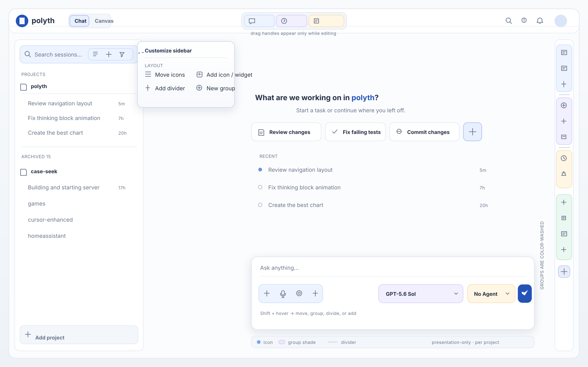

# Icon sections customization proposal



## Interaction

- Hold **Shift** while hovering an icon section to reveal its edit affordance;
  the existing explicit **Edit** mode can expose all sections at once.
- Drag an icon by its handle to move it before another icon. Drop it on a group
  to add it to that group. `Shift+F10` and keyboard move commands remain
  available for keyboard users.
- Open the section menu to add an installed icon/widget, add a divider, create
  a group, or change a group's shade. On touch, the same menu is a Sheet; there
  is no hover-only behavior.
- Keep ordinary text-entry surfaces stable: a bare Shift held while an input or
  composer is focused must not enter customization.

## Smallest implementation

Use one presentation-only, project-scoped layout record for every icon section.
Existing capability and widget ids remain the item ids, so package registration
does not change:

```ts
type IconSectionLayout = {
  version: 1;
  sections: Record<string, {
    order: string[];
    dividers: { id: string; before: string | null }[];
    groups: { id: string; label: string; color: "accent" | "blue" | "purple" | "amber" | "green"; items: string[] }[];
  }>;
};
```

Store it under `polyth.iconSections.v1.<projectId>` in `localStorage`. It is
pure UI preference data: it never enters the session event log or a model
prompt. Normalize unknown/removed ids on read and append newly registered
items to the end, so plugins remain safe to enable and disable.

Add one host primitive, `IconSection`, rather than teaching every toolbar its
own drag/drop rules. It should:

1. render the normalized order;
2. render real `role="separator"` nodes;
3. wrap group members in a color-wash container with a small semantic accent;
4. expose the shared add/edit menu; and
5. preserve each current section's behavior and accessibility labels.

Use it for `app.header.center`, `sidebar.toolbar`, `workspace.rail`,
`composer.leading`, `composer.trailing`, and the fresh-session widget row.
The Widget Library remains the discovery surface; the section menu is the fast
local “add this here” path.

## Visual rules

- Group shades use existing semantic washes (`--accent-wash`, `--blue-wash`,
  `--purple-wash`, `--amber-wash`, `--green-wash`) and their matching ink;
  never hard-code a competing palette.
- A group is still understandable in monochrome: use its label in edit mode,
  a boundary/accent edge, and `aria-label`, not color alone.
- Dividers are structural and quiet (`--surface-divider`), not full heavy
  borders around every icon.
- The section's normal footprint does not change when Shift is pressed; edit
  chrome is an overlay or reserved at the end of the row.

## Rollout

1. Add the normalized store and pure move/group/divider functions with
   `node:test` coverage.
2. Replace the top/right capability reorder adapters and `SlotHost` mini-widget
   reorder path with `IconSection` adapters; then wrap sidebar/composer/static
   controls using stable ids.
3. Add the menu actions and a small settings preview. Keep the current widget
   library and capability discovery as the source of available items.

This keeps the feature reversible and avoids another widget or capability
registry. The mockup shows the intended end state, not a second runtime shell.
